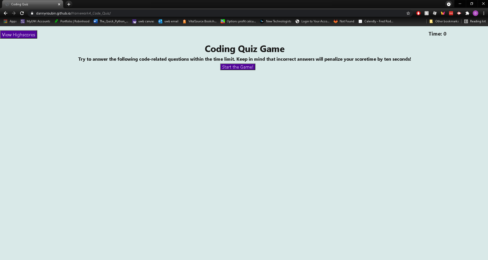

# Homework4_Code_Quiz

## Link to live website
https://dannyroubin.github.io/Homework4_Code_Quiz/

## Description
The goal of this project was to create a quiz that would test a users javascript knowledge.

This project was pretty tough for me and I ran into many issues while creating this project, but overall, it was a very good project to do since I expanded my usage ability with logical operators in javascript

## Usage
To play the game you simply press the button to start the game and go through each question. If you win you put your initials and it'll be recorded with your time. 

